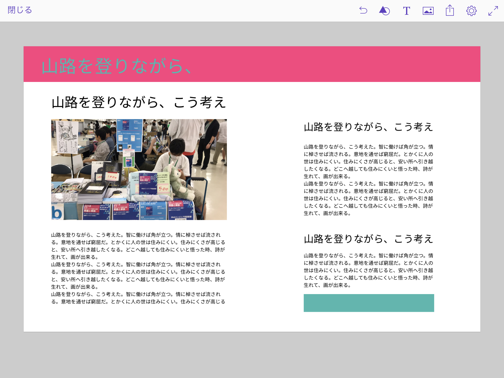
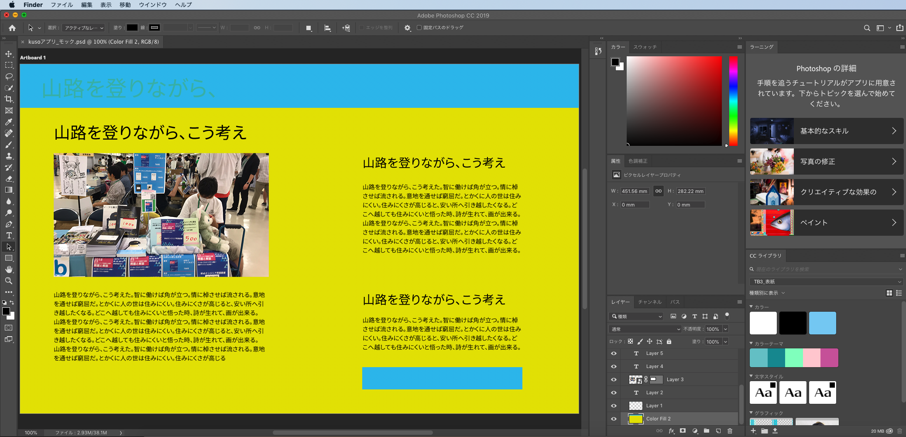

# どんなアプリケーションを作りたいか決める

## どんなジャンルを作るかを決める

私は「クソアプリカレンダー面白そう！枠も空いている！よーしポチッとな！」と参加登録をした後で大変なことに気づきました。**アプリケーションを作って公開したことがないのです**。なんでもそうですが、毎回申し込んだ後に「やめておけばよかった」と後悔しつつ何とか締め切りに合わせて完成させる、みたいな生活なはほんと改善したいです。

…ということで、まず個人で開発できそうなWebアプリケーションにはどんなものがあるのか調べてみました。

### 本格的なもの

ここでの``本格的なもの``とは、次の要素を含んでいるWebアプリケーションを指します。

- 独自ドメインを利用している
- ページ遷移がある
- RDBや外部ストレージからデータを取得している
- ログイン・ログアウトできる
- 投稿処理がある

イメージはTwitterやInstagramのように、ユーザーに紐づく機能と一般の人がWebページ的な感じで閲覧できる機能がセットになっている + データが永続化されているものを思い浮かべました。この規模になると、クソアプリカレンダーではなく、個別にブログやQiitaに投稿を書いて宣伝しているイメージがありますね。

スマートフォン関連の技術ですが、最初から対象外として考えました。というのも、私自身が今までインフラエンジニア寄りの仕事しか経験がなく、業務で本格的にコードを書いてレビューしてもらう…という経験が2ヶ月弱しかなかったためです。TypeScriptでヒーヒー言っているのに、他の言語やそのビルド・デプロイ・環境構築を短期間で覚えて公開できるものをつくるのは無茶だなと思ったのでやめました。

### 開発者ツール的なもの

アプリケーション開発者が、開発者のために作るツールを思い浮かべました。ジャンルとしては、次の3つに分かれているなと感じました。他にもあると思います。

- エディタの機能拡張
- テキストの整形ツール
- プラグイン

開発者ツール的なものは始めから対象から外しました。そもそも**KUSO**アプリケーションを作成するのですから、開発者向けツールとは全く相性が合いません。主旨を外れてしまいます。

### ポートフォリオ

クソアプリカレンダーでは見た目におふざけ要素を全力で投入したような、ファンキーなサイトが多く見られました。普通に作っている場合、自分の業務履歴や成果物を一覧として表示されているものが多かったです。ページ遷移する・しないは人によりけり、という印象を持ちました。

### その他

コマンドラインで完結するおふざけツールや、ゲーム、ちょっとコンプライアンス的にやばそうな代物など、分類できない何かが大半でした。おふざけセンスがみなさんよくて、見習いたいなと思いました。面白い事出来る人はほんとすごいなー。

## で、何作ろう

今回は自分でWebアプリケーションを作るのが初めて、ということもあり、次の要素を重視しようと思いました。

###  公開する

まず第一に、URLをクリックしてアクセスするものを作ろう、と考えました。Webアプリケーションを作成してデプロイするまでの一通りの流れを知っていると、周辺技術ネタにもついていきやすいですし、やりきった感を感じたいなーと思ったためです。

### 動的なサイトにする

``動的な``状態とは、クライアントのリクエストに応じてWebサイトの内容が書き換わるWebアプリケーションのことを指しています。
``静的な``状態はこの逆で、一度アクセスするとWebサイトの内容はずっと同じ状態です。

つまり、HTML + CSS + 見た目の処理（ジャンプボタンで上にスクロールするなど）を行うJavaScriptで作成されたサイトは作らないということです。

仕事でVue.jsを使っていたのでVueもっとやってみたいわ〜、という単純明解な動機が理由です。

### お金をかけないようにする

お金がないので…というのもありますが、作ったらすぐデプロイできて、不要になったらすぐ壊せる環境が良いなと思いました。

個人開発でサーバー構築・管理をするのはそれなりに本格的な規模のものを作るときかなと思ったのと、使える時間が少ないとわかっていたことも理由の中に入っています。

### 結論

これらの要素から、**同人誌のポートフォリオサイト**をVue.jsで作ろうという結論に達しました。
私はりまりま団名義で技術同人誌を6冊出しています。よって、同人データをどこかから取得して画面に割り当て、ボタン操作などて動的に切り替えることが可能です。

さらに、ポートフォリオを作っておくと「今までこういう本を書きました」と言いたいときにURLを貼り付けるだけで終了します。もう過去のエントリをかき集めるのは嫌なのです。毎回自分のブログを検索するのには疲れたんです。

## どんなポートフォリオを作るか考える

作るものが決まりましたので、今度はどんなポートフォリオをつくるか？を考えることにしました。

### なにを載せるか？

レイアウトを決める前に、どんな項目がどのくらいあるかを考えました。レイアウトは項目に合わせて組まないと「あぁー！入らないーーーー！！！！」となる気がしたためです。
毎回探してるわ…もう検索したくないわと思ったものを載せようと考えたところ、次のリストができました。

- 本のタイトル
- 書影
- 概要の説明文
- 通販のURL
- 紹介ブログのURL
- 商業本のURL[^book]

[^book]: 何気に1番探すのが面倒くさい

これだけでも良かったのですが、クソアプリカレンダーにエントリーしているので同人誌のKUSOポイント（リスト形式の概要）も項目として追加しました。全部で7項目を表示したいことになります。

### レイアウトを検討する

項目が決まったので、レイアウトの検討に移ります。``ポートフォリオサイトまとめ``といったタイトルがついているWebページを開いては「オシャンティすぎる…」と肩を落とすことを20回くらい繰り返しました。

最終的に、PC向けWebサイトのレイアウトをいくつか比較し真似することにしました。
BoothやUNIQLOなどの通販サイトは、レイアウあとを検討する際にとても参考になります。なにかを紹介する、という目的は一緒なので、最初から参考にすれば良かったなと思いました。

### ワイヤーフレームを作成する

``ワイヤーフレーム``は、Webサイトを構成する要素の配置図の役割を持っています。絵を描く人のメイキングを見ると、

1. 下書き
2. 主線を引く
3. 色塗り
4. 仕上げ

この順番で工程を組んでいる人が多いです。はじめに何枚か下書きをすることで、より良い絵の構成にならないか検討するのだそうです。
これはWebサイトのデザインも一緒で、ワイヤーフレームを作成してデザインの配置を決めたあと、``デザインカンプ``と言われる完成品の絵を描き上げ、それを元にコーディングを行うのが一般的な制作フローとなっています。

今回は自分でデザインを書いて、自分でコーディングを行うので、デザインカンプは書きませんでした。デザインを変えたくなったときにカンプを書き換えるのは手間がかかりますし、デザインカンプの目的は複数人で作業するときに使われるものなのでいらないかなと思いました。

では、どうやってワイヤーフレームを作成すれば良いのでしょう？まず、ワイヤーフレーム作成ツールを調べてみました。

- 紙とペン
- Sketch
- Cacoo
- Adobe Photoshop
- Adobe XD
- Power Point 

などなど、アナログ・Webサービス・デスクトップアプリケーションといった多種多様なツールがあることがわかりました。

今回私が利用したのはAdobe Comp CCというiPad用アプリケーションです。

手で図形を書くと形を認識し、アプリケーションが自動で整形してくれるのです。文字はダミーのテキストを挿入することが可能で、大まかな大きさを指定することができます。もちろん画像も配置できます。詳しく書く要素のスタイルを指定することは不可能ですが、iPadとApple Pencilだけで綺麗なワイヤーフレームを記載できる点がとても嬉しいです。私はAdobe CCライセンスを持っているため、Adobe Compで記載したワイヤーフレームをAdobe PhotoshopやXDに連携することが可能です。というわけで、早速ワイヤーフレームを作成しました。

写真は適当にいれました。30分あれば簡単にワイヤーフレームが作成できるのが嬉しいですね。
画像の四角の部分は私がテキトーに書いた長方形です。スワイプとピンチアウト/インの操作で大きさを調整し、配置していきます。テキストは画面右上にボタンがあるため、そこを押してテキストを出します。

### Adobe XDにワイヤーフレームをとりこむ

先にも述べたとおり、Adobeのアカウントによって全てのAdobeアプリケーションが連携しています。Adobe CompでPhotoshopへデータを送信、そのあとAdobe XDで読み込むようにしました。便利ですね。

先にPhotoshopでフォントサイズを細かく指定しておくと、XDで読み込んだときに個別のフォントサイズを確認しながらHTMLを組むことができます。これはかなり便利でした。各要素のピクセル数も表示できるので、ワイヤーフレームやデザインカンプ上で本物のサイズを指定しておいた方が、実装時に迷わなくてすみます。

これで準備はできました。いよいよVueプロジェクトを作成して開発に入ります。

## 参考URL

### 絵の製作工程

#### 12色でスタート! はじめてのコピックイラスト（ばびりぃ (著), 株式会社トゥーマーカープロダクツ (著), 編者:株式会社マール社）

物作るのってほんと大変だよなあ…と思いますね。コピック持ってるんですけど、まっすぐ線を引いてるだけで楽しいです。

- https://www.maar.com/shop/comic/12色でスタート！-はじめてのコピックイラスト

### ワイヤーフレーム作成ツール

#### Adobe Comp CC

- https://www.adobe.com/jp/products/comp.html

#### その他のアプリケーションから Adobe XD にアセットを読み込みます。

PhotoshopからXDにpsdファイルを読み込むときに参考にしました。Adobe製品はUIがコロコロ変わるので、公式サイトを見たほうが早いと思います。最近はチュートリアルも充実しています。

- https://helpx.adobe.com/jp/xd/help/working-with-external-assets.html