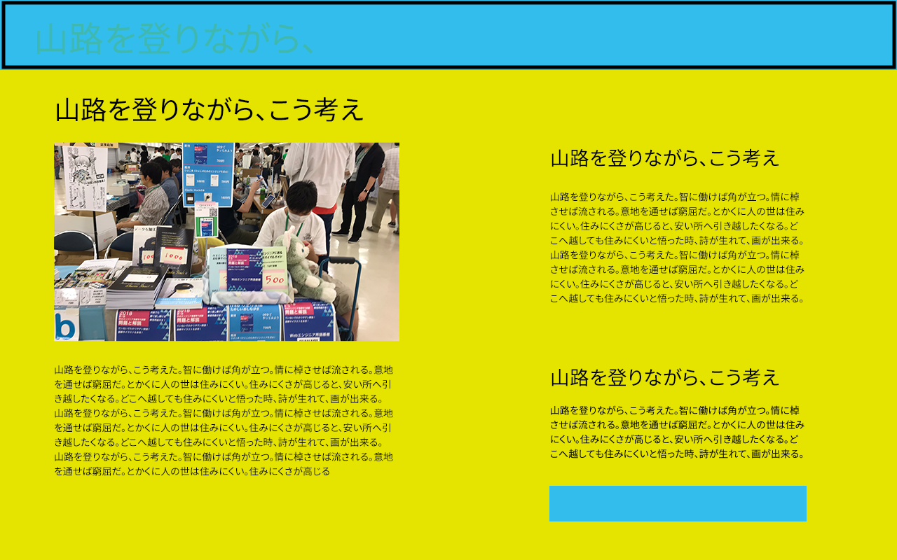
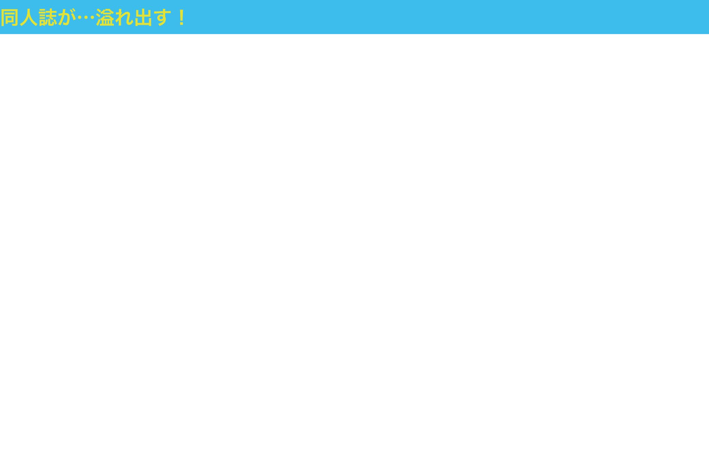
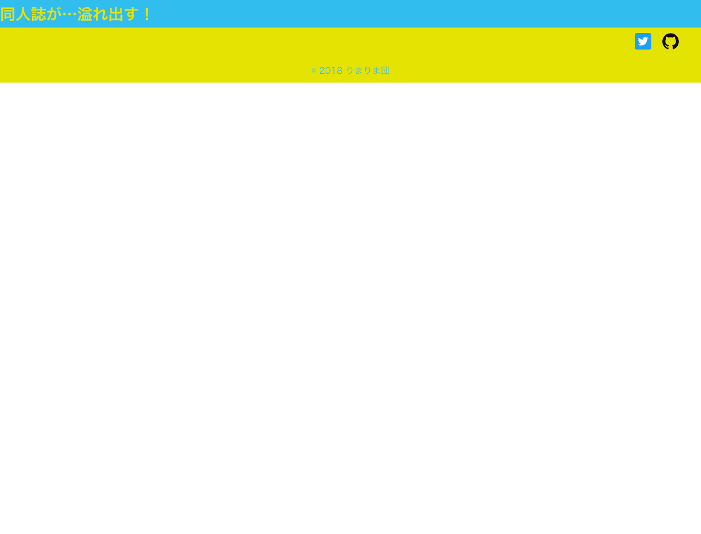

# Vueプロジェクトの作成〜#2 フッターの作成

先に見た目を作って色々調整しよう！わかりやすいから！という方針で進めました。これは大正解だったと思います。なぜなら、見た目ができていると安心感がありますし、進捗していることが目で見てわかるからです。

## Vueプロジェクトをどうやって作るか検討する

Vue.jsのプロジェクトを作るときに、いくつか方法があります。

- CDNを利用してVue.jsをインポートする
- Vue CLIを利用する
- Nuxtを利用する

今回はVue CLIを利用することにしました。理由は次の通りです。

- SSRする必要がない
- 画面の各要素はコンポーネントにわけておきたい

### SSRする必要がない

SEO対策とか検索がどうこうとかを考えるとSSR対応した方がいいのかなとおもったのですが、KUSOアプリが検索上位に来られても困るので別にSSRする必要ないわと思いました。

### 画面の各要素はコンポーネントにわけておきたい

CDNを利用してもコンポーネントを作ることはできます。しかし、今回は画面のパーツごとにコンポーネントを作りたいと思いました。理由は今後見た目や色などを少しだけ変えたいとき、コンポーネントに別れていた方が修正が楽かなと思ったためです。Vueのファイルは画面の要素と処理部分を1ファイルにまとめて記載するため、ファイルの行数が長くなる傾向があります。複雑になると平気で400行近くになってしまい、変数とHTMLの対応を追いかけるだけでも大変です。

仕事で作るようなアプリケーションなら処理も複雑になるのでまあ分からなくはないのですが、個人開発でそんなファイルはメンテナンスしたくありません。というわけで、画面の要素はなるべく小さくわけることにしました。

個人開発はモチベーションを保つのが難しいので、何かしら「進捗している」感を演出する仕掛けを作っておいた方が良いです。今回は、1コンポーネントごとにissueをたてることにしました。さらに、開発時に出た不具合や改善点もissueを記載することにしました。issueが閉じられると何かしらの進捗を感じられ、かつGitHubのContributionにも反映されるため一石二鳥です。

## プロジェクトの作成

公式ドキュメントに沿って進めます。まず、パッケージ管理システム``npm``を用いてVue.jsをインストールします。``yarn``というパッケージ管理システムもあるのですが、仕事で利用したことがないので今回は利用しませんでした。

```bash
$ npm install -g @vue/cli
``` 

Vue CLIをインストールした次は、Vueプロジェクトを作成します。

```bash
$ vue create プロジェクト名
```

今回は``portfolio-vue``というプロジェクト名にしました。対話形式で基本設定を行います。ESLintを利用することのみ指定します。1ページのWebアプリケーションなのでルーティングは必要ありませんし、TypeScriptを利用しないで開発してみたいなと思ったからです。 [^typescript]

[^typescript]: 仕事ではVue.jsとTypeScriptで開発しています。メソッドの勝手がかなり違うので、なんだか別物のように感じてしまいます。

これで開発準備はできました。GitHubでのコミットハッシュ値は[747b37](https://github.com/MofuMofu2/portfolio-vue/commit/747b37da5ddb697bcc80d1e20b4053b1b89a2bcc)です。

## #1 ヘッダーの作成

まずはじめに、ヘッダーを作成します。今回のワイヤーフレームの中では画像の四角で囲ったところをヘッダーとしました。



### Vue.jsの基本的な書き方でヘッダー要素を作成する

まず、実際に画面に表示される``App.vue``ファイルに``Header``コンポーネントを追加します。``Header``と``Footer``は予約語扱いなのか、App.vueへインポートするときの名前は別の名前にする必要があります。``Header.vue``にはヘッダーの表示部分に関するコードのみが記述されます。``<template>``にはHTMLを、``<script>``にはVue.js（JavaScript）の処理を、``<style>``にはCSSを記述します。

```JavaScript
<template>
  <title-header></title-header>
</template>
<script>
import titleHeader from './components/Header.vue'
 export default {
  name: 'app',
  components: {
    'title-header': titleHeader
  }
}
</script>

<style>
</style>

```

次に、Header.vueの内容を作成します。``h1``タグの``{{ title }}``という部分はMustache記法という名前がついています。``data``という部分の``title``に割り当てられている``同人誌展示会場``というデータが``h1``タグとして表示されますよ、という意味です。``data``の部分を置き換えるだけでHTMLの描画内容を変更することができます。

```JavaScript
<template>
  <h1>{{ title }}</h1>
</template>
<script>
export default {
  name: 'titleHeader',
  data () {
    return {
      title: '同人誌展示会場'
    }
  }
}
</script>
 <style scoped>
  h1 {
    background-color: #32BDED;
    color: #E5E400;
    height: 100px;
  }
</style>
```

最後に、Vueプロジェクトの設定ファイルを記載します。

```JavaScript
const path = require('path')
module.exports = {
  pluginOptions: {
    'style-resources-loader': {
      preProcessor: 'scss',
      patterns: [
        path.resolve(__dirname, './src/styles/abstracts/*.styl'),
      ]
    }
  }
}
```

ここまで書けた後、ターミナル上で``npm run serve``コマンドを打ち込みVue.jsの環境を起動します。``localhost:8080``にアクセスすると、次のような画面が見えました。


### CSSで見た目を整える

よく見ると、ブラウザの端っこに隙間が空いてしまっています。これはブラウザごとにデフォルトのCSSというものが設定されており、h1タグはmargin（要素同士の間隔を決める）はいくつ…などと決まったCSSが割り当たってしまっているためです。デフォルトのCSSはブラウザごとに設定が異なるので、何も設定しないと同じCSSなのに見た目がバラバラになってしまいます。

このままでは困るので、``normalize.css``というものを導入します。これはブラウザに割り当てられているCSSを活かしつつ、ブラウザ間の差異を吸収してくれるCSSです。同じような役割を持つCSSとして``reset.css``というものも存在します。今回は``normalize.css``を利用することにしました。
理由は``reset.css``はブラウザ独自のスタイルを打ち消しし、デフォルトのCSSを割り当てるからです。CSSの打ち消しは画面の描画に時間がかかる原因となるため、なるべく打ち消しが起こらないCSSが良いCSSと言われます。保守の観点からも、CSSの打ち消しは避けましょうと言われるようです。

``normalize.css``を``npm install``でインストールします。コマンドライン上でプロジェクトのディレクトリに移動し、次のようにして``normalize.css``をインストールしました。

```bash
$ npm install normalize.css
```

そして、``Header.vue``に``normalize.css``をインポートします。後で全てのコンポーネントがインポートされている``App.vue``に記述を移し替えました。こうしておくと、他のコンポーネントファイルに``normalize.css``のインポート文を書かずに済むためです。

```JavaScript
<template>
  <h1>{{ title }}</h1>
</template>
<script>
import 'normalize.css'
export default {
  name: 'titleHeader',
  data () {
    return {
      title: '同人誌が…溢れ出す！'
    }
  }
}
</script>
 <style scoped>
  h1 {
    align-items: center;
    background-color: #32BDED;
    color: #E5E400;
    display: flex;
    font-size: 28px;
    height: 50px;
    margin: 0;
  }
</style>
```

最終的な見た目はこのようになりました。ヘッダーを作るという目的は達成できたので、ブランチをGitHubにpushし、masterブランチへmergeしました。



## #2 フッターの作成

今度はフッターを作成します。ワイヤーフレームではフッターに色をつけていたのですが、試しに実装してみると目がチカチカしてしまいました。気分も悪くなりそう（酔ったみたいな感じ）なので、これはボツにしました。

何を記載すれば良いか迷ったので、ほかのポートフォリオサイトにどんな要素が載っているのか調べてみることにしました。多かった項目は次の3つです。

- SNSのアカウント情報
- （技術に関するものの場合）GitHubのアカウント情報
- コピーライト表記

SNSのアカウント情報はTwitterとFacebookの採用率が飛び抜けていました。やはり盛り上がっていて拡散力があるのでしょう。次点でInstagramが多かったです。Webサイト巡りをしていて感じたのは、情報が多いとゴテゴテして見づらいということと、文字よりアイコンの方がわかりやすいということです。
色々書いてあったとしても、結局読まれなければと意味がないですよね。それに文字がぎっちり詰まったサイトは読みづらいです。加えてアクセスした人のPCモニターサイズが大きいとは限りません。小さい窓にたくさん文字がある状態では、とてもじゃないけどサイトをじっくり見ようという気持ちにはなれません。

結果、次の3つをフッターに記載しようと考えました。

- SNSのアカウント（Twitter）情報
- KUSOアプリケーションのGitHubリポジトリ
- コピーライト表記

最初はコピーライト表記のことなど頭になかったのですが、これがないと自分のWebサイト内の文章や画像などを転載されてしまったときに「表記ないんだからいいじゃん」と言われてしまいます。別に転載するほどの情報ではない…とは思ったのですが、念の為入れておくことにしました。後から後悔しても遅いですからね。

### コピーライト表記の書き方を調べる

書き方がわからないので、Webサイトを回遊しているときに見かけたコピーライト表記を真似しようと思いました。最初はWebサイト表記で一番多かった、``Copyright ©️ 2018-2018 りまりま団 All Rights Reserved.`` のように記載すれば良いのかと思ってました。しかし、これはどうやら正確な書き方ではないようでした。

まず、``©︎``は``コピーライト``という意味のため、``Copyright``は不要となります。コピーライトコピーライトと記載してあるのと意味が同じだからです。無駄な表現は削っておきたいですよね。次に年号の表記方法ですが、絶対に必要なのは**そのWebサイトを立てた年＝発刊年**だけであって、``-2018``の部分はWebサイトが更新された年号を表しているだけで表記が必須ではありませんでした。
最後に``All Rights Reserved.``の部分はブエノスアイレス条約という1910年に成立された著作権を守るための条約内で規定されている文言であり、日本はブエノスアイレス条約に加盟していないため、記載しても著作権の保護を受けることはできません。日本に国籍がある私が作ったKUSOポートフォリオは、この文言で著作権の保護を受けることはできないということです。つまり``All Rights Reserved``表記は不要となります。

これらの情報を総合した結果、最終的なコピーライト表記は

> ©︎ 2018 りまりま団

となりました。

表記方法を決めたので、アプリケーションにこれを反映します。DOMにデータを割り当てして表示する・またはHTMLに直接記載する2パターンで描画することができます。

### SVGアイコンを利用した外部リンクを作成する

Webサイト外のURLに接続したい場合、HTMLでは``a``タグを利用してURLを表示することができます。これではURLが文字で表示されてしまいます。``a``タグの中に文字を入れればURLにジャンプできる文字を作成することはできます。しかし、TwitterやGitHubのようにアイコンが有名なコンテンツへのリンクであれば、アイコン自体をURLリンクにしたいですよね。わかりやすいですし、情報量が少ない分見栄えも良くなります。

そこで、TwitterとGitHubの画像アイコンを入手し、それにURLを割り当てて外部リンクアイコンにしようと考えました。

### アイコン画像を入手する

まずはじめに、アイコン画像を入手します。

GitHubは[GitHub Logos and Usage](https://github.com/logos)（``https://github.com/logos``）から公式のアイコンをダウンロードすることができます。ダウンロードページには、許可されていること・されていないことが記載されています。ルールを簡単にまとめると、

- ロゴやOctocatを自分のアプリケーションのアイコンとして利用してはいけない
- アイコンの画像を改変してはいけない
- 自分の絵にロゴやOctocatを使ってはいけない
- GitHubの許可なくロゴやOctocatの何かを販売してはいけない
- アイコンの色・書体の変更は禁止

となっています。つまり、GitHubへページ遷移する・GitHubに関する記事の投稿時にアイコンを利用する分にはいいけれど、それ以外の用途で利用するのは禁止ということです。

GitHubのアイコンをダウンロードすると、PNG画像とaiファイル・epsファイルが圧縮された物を手に入れることができます。今回はSVGを利用したいと思ったので、aiファイルからIllustratorを利用してSVGファイルを作成しました。寸法の変更は禁止されているため、aiファイルを開いた後、そのままSVG画像を書き出しました。
Vue.jsアプリケーションでアイコンを利用したいので、``src/assets``ディレクトリの下にアイコンを配置します。

Twitterのアイコンは[Twitterのブランドリソース](https://about.twitter.com/ja/company/brand-resources.html)（``https://about.twitter.com/ja/company/brand-resources.html``）からダウンロードします。TwitterはSVGファイルが直接配布されているため、これを直接利用します。Twitterの場合、アイコンをダウンロードするとガイドラインを記載したPDFもダウンロードできます。もちろんTwitterのサイト内に記載があります。こちらはわざわざ絵で解説が書いてあります。利用前によく確認します。と言っても、ルールはほとんどGitHubと一緒です。唯一異なる点は、Twitterの古いアイコンを利用してはいけないという点です。利用する気にはなりませんが…。
こちらもサイズの変更などはせず、ダウンロードしたものをそのまま``src/assets``ディレクトリに配置します。

### アイコン画像をVue.jsで読み込む

Vue.jsでローカルの画像を表示する場合、``a``タグ内に``img``タグを配置し、画像URLのデータを``v-bind``で割り当てます。``v-bind``に割り当てる情報は変化する予定がないため、#1のヘッダー作成時と同じく``data``を利用することにしました。
今までの知識を総合すると、次のように記載すれば動くはずです。

```JavaScript
<template>
  <div class="page-footer">
    <div class="icons">
      <a href="https://twitter.com/froakie0021" target="blank">\r
      </a>
      <a href="https://github.com/MofuMofu2/portfolio-vue" target="blank">\r
      </a>
    </div>
    <div class="copyright">
      <p>©︎ 2018 りまりま団</p>
    </div>
  </div>
  
</template>

<script>
export default {
  name: 'pageFooter',
  data() {
    return {
      twitter_src: \r
      "../assets/footer/Twitter_Social_Icon_Rounded_Square_Color.svg",
      github_src: \r
      "../assets/footer/GitHub-Mark.svg"
    }
  }
}
</script>
```

しかし、これはうまくいきません。画像が表示されないのです。回避方法を先に言ってしまうと、``src``のバインドをするときに``require``を利用すれば良いです。実際に試してみましょう。
GitHubアイコンのパスには``require``をつけ、Twitterのアイコンのパスはそのまま``data``に記載します。

```JavaScript
<script>
export default {
  name: 'pageFooter',
  data() {
    return {
      twitter_src: \r
      "../assets/footer/Twitter_Social_Icon_Rounded_Square_Color.svg",
      github_src: \r
      require("../assets/footer/GitHub-Mark.svg")
    }
  }
}
</script>
```

Chromeのデバッグツールを使って、どんなデータがimgタグにバインドされているか確認します。変だなと思ったらすぐデバッグツール。これはテストに出ます。
まず、正しく表示されるはずの``github_src``にどんなデータが割り当たっているか確認しました。

```json
github_src:\r
"/img/GitHub-Mark.4336b50b.svg"
```

VueアプリケーションをVue CLIで構築する際、アプリケーションの構成ディレクトリ内のファイルを再構成して``dist``ディレクトリへ再配置します。このとき、``assets``ディレクトリ内の画像も一緒に``dist``ディレクトリに再配置されます。``require``を利用することで、再配置後の画像ファイルパスを割り当てることができるため、画像が表示できるのです。
では、Twitter画像のファイルパスはどうなっているのでしょうか？

```json
twitter_src:\r
"../assets/Twitter_Social_Icon_Rounded_Square_Color.svg"
```

こちらはファイルパスがそのまま割り当てされてしまっています。Vueアプリケーションが参照するのは``dist``ディレクトリの中ですから、これでは画像フォルダを参照することはできません。その結果、画面は正しく描画されているけれど画像がない状態になってしまうのです。
``require``を利用することで、画像ファイルのパスを正しく描画することができる、というわけですね。初めてだとかなり詰まるポイントだと思います。

### CSSを追加する

画像ファイルパスの記載方法がわかったので、CSSも追加した最終形を作成しました。

```JavaScript
<template>
  <div class="page-footer">
    <div class="icons">
      <a href="https://twitter.com/froakie0021" target="blank">\r
      </a>
      <a href="https://github.com/MofuMofu2/portfolio-vue" target="blank">\r
      </a>
    </div>
    <div class="copyright">
      <p>©︎ 2018 りまりま団</p>
    </div>
  </div>
  
</template>

<script>
export default {
  name: 'pageFooter',
  data () {
    return {
      twitter_src: require("../assets/Twitter_Social_Icon_Rounded_Square_Color.svg"),
      github_src: require("../assets/GitHub-Mark.svg")
    }
  }
}
</script>

<style scoped>
  .page-footer {
    background-color: #E5E400;
    height: 100px;
  }
  .icons {
    margin-right: 30px;
    text-align: right;
  }
  .icons img {
    height: 30px;
    margin: 10px;
    width: 30px;
  }
  .page-footer p {
    color: #32BDED;
    text-align: center;
  }

</style>
```

ブラウザで確認すると、このようになっています。



まだ見た目はしょぼいのですが、目的は達成できたのでmasterブランチにMergeしました。

## 参考URL

### Issues

- https://github.com/MofuMofu2/portfolio-vue/issues/1
- https://github.com/MofuMofu2/portfolio-vue/issues/2

### Pull Requests

- https://github.com/MofuMofu2/portfolio-vue/pull/11
- https://github.com/MofuMofu2/portfolio-vue/pull/12

### Vueのセットアップ

### Vue

#### はじめる

- https://jp.vuejs.org/v2/guide/

#### インストール

- https://jp.vuejs.org/v2/guide/installation.html

#### コンポーネントの基本

- https://jp.vuejs.org/v2/guide/components.html

#### コンポーネントの登録

- https://jp.vuejs.org/v2/guide/components-registration.html

### Vue CLI

#### Get Started

- https://cli.vuejs.org/guide/

#### インストール

- https://cli.vuejs.org/guide/installation.html

#### プロジェクトのセットアップ

- https://cli.vuejs.org/guide/creating-a-project.html

### normalize.css

#### [CSS]CSSリセットとは異なる、Normalize.cssの特徴や使い方などの解説 -About normalize.css | コリス

- https://coliss.com/articles/build-websites/operation/css/about-normalize-css.html

#### Normalize.css: Make browsers render all elements more consistently.

- https://necolas.github.io/normalize.css/

### Vue.jsでimgタグのsrcを利用する

- Vue.jsでimgタグのsrcをバインドさせる際の注意点 
  - http://tk2000ex.blogspot.com/2017/11/vue.html
- img src data binding?
  - コメントの前半は内容が古くなっているため注意が必要です。``require``が出てきている箇所あたりを参考にしましょう。
  - https://github.com/vuejs/Discussion/issues/202#issuecomment-330567354
