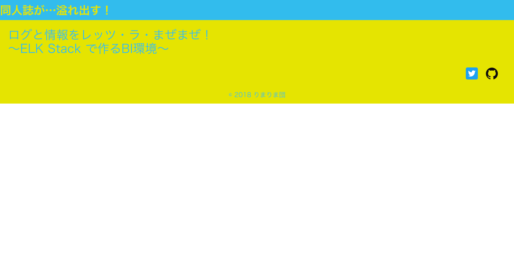
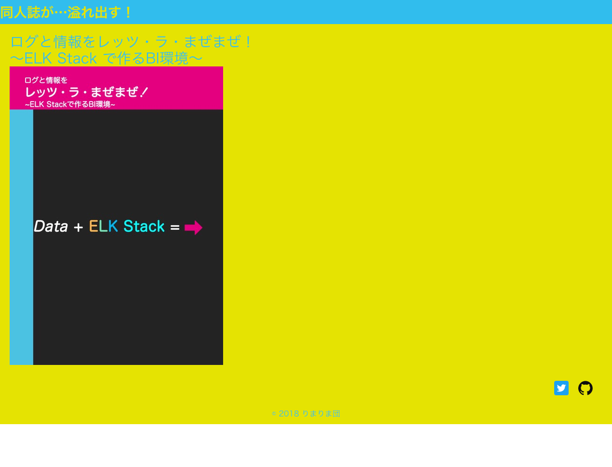
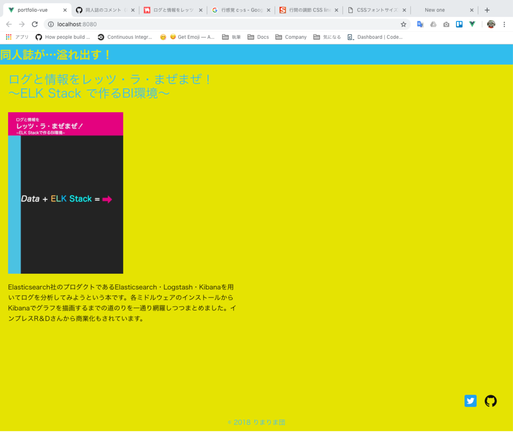
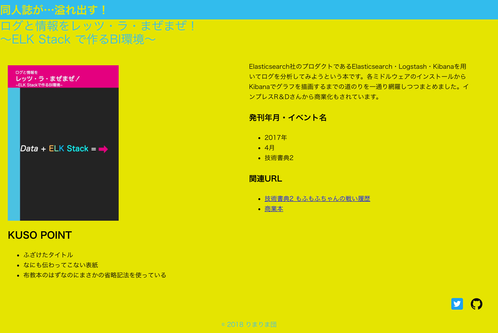
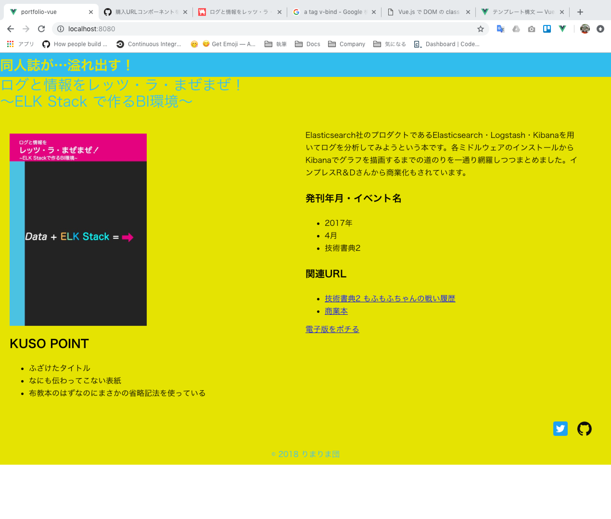
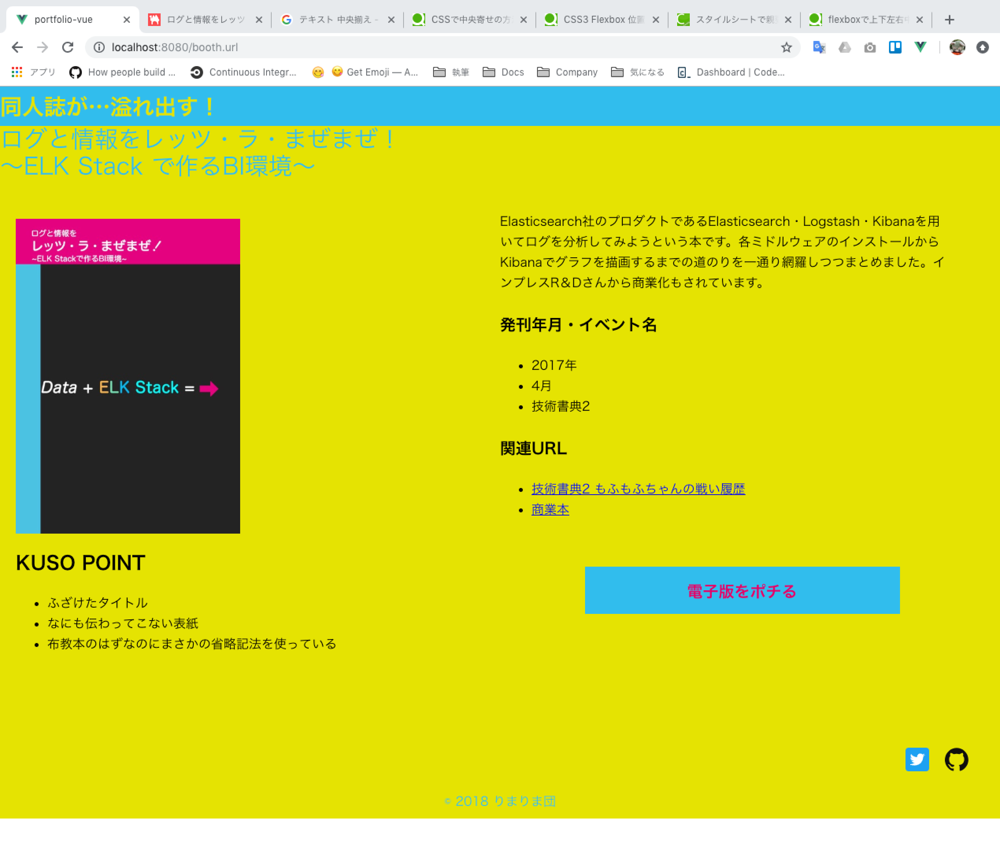
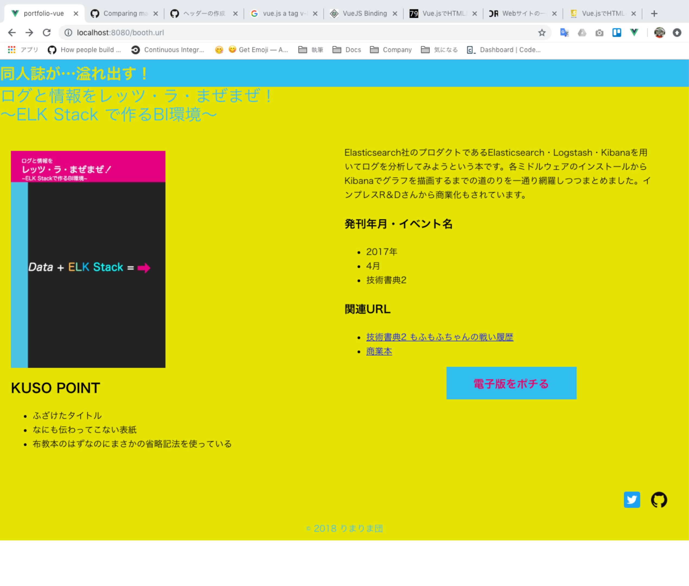

# #4〜#8 v-bindで同人誌の情報を表示するコンポーネント群を作成

今までは固定の情報をv-bindに割り当てて表示するコンポーネントを作成しました。しかし、このポートフォリオの目標は今まで発刊した同人誌の情報を一つのサイトにまとめることです。つまり、将来的にはv-bindのデータを動的に切り替える必要があります。
いきなり実装するのは難しそうなので、まずはHTML・CSS・基本的なv-bindの処理だけを先に記載することにしました。実装後に感じたことなのですが、見た目を作る作業と処理を書く作業は別々に行った方がいいなと思います。不具合が起きてしまったときに、見た目と処理、どちらの実装が悪いのか判断するのが難しいためです。個人的には見た目を先に作り、処理を書いた方が進めやすいなと感じました。最終形が早く見える方がモチベーションを高く保つことができるためです。

## #4 KUSOタイトル表示コンポーネントの作成

まず、コンポーネント用のファイルを作成し、App.vueへimportします。アプリケーションのmainコンテンツもKUSO感を出したいと思ったので、``<style>``タグに背景色（すごい色の黄色）を追加しました。また、ヘッダー・フッターとの距離が詰まって見えたので``main``タグには``margin``を設定しました。これで上下左右の間隔を空けることができます。

### App.vueにKUSOタイトル表示コンポーネントを読み込む

```JavaScript
<template>
  <div id="app">
    <title-header></title-header>←ここを追加
    <div class="main">
      <book-title></book-title>
    </div>
    <page-footer></page-footer>
  </div>
</template>

<script>
import 'normalize.css'
import titleHeader from './components/Header.vue'
import bookTitle from './components/BookTitle.vue'←ここを追加
import pageFooter from './components/Footer.vue'
 export default {
  name: 'app',
  components: {
    'title-header': titleHeader,
    'book-title': bookTitle,←ここを追加
    'page-footer': pageFooter
  }
}
</script>

<style>
   #app {
    background-color: #E5E400;
  }
  .main {
    margin: 20px;
  }
</style>
```

### 同人誌を表示するためのコンポーネントを作成する

今度は同人誌を表示するためのコンポーネントを作成します。実際に開発するときは、

1. ファイル作成
2. ``<style>``などのテンプレートを記載
3. App.vueにインポートする処理を記載
4. コンポーネントの中身を記載

という順番で進めています。こうすればブラウザでコンポーネントの内容を確認しながら進めることができますし、インポートし忘れを防ぐことができます。
コンポーネントの開発内容はヘッダー・フッターと特に代わりなく、特定の文字列を特定のHTMLタグにv-bindで割り当てるだけです。

```JavaScript
<template>
  <div class="book-title">
    <div class="fanbook-title">
      <fan-book v-bind:title="item">{{ item }}</fan-book>
    </div>
  </div>
</template>
 <script>
export default {
  name: 'bookTitle',
  data() {
    return {
      item: "ログと情報をレッツ・ラ・まぜまぜ！～ELK Stack で作るBI環境～"
    }
  }
}
</script>
 <style scoped>
  .book-title {
    background-color: #E5E400;
    color: #32BDED;
    font-size: 30px;
  }
  .fanbook-title {
    width: 520px;
  }
</style>
```

HTMLタグにデータを割り当てる方法は2種類あります。使い分けに迷ったので公式ドキュメントや実装例を見たところ、

- 特定の決まったデータを割り当てるのであれば``v-bind``
- テキストボックスに入力した値を画面でもすぐ表示したい、といったように双方向の描画が必要なときは``v-model``

このように使い分けるのが良さそうだ、と思いました。利用比率的には圧倒的に``v-bind``の方が多いな、という印象です。双方向描画は処理が重たくなりそうなのでできる限り使わないようにしているのかな、と思いました。
実装後はこのようになりました。タイトルからもKUSO感が溢れ出ていて絶好調です。



## #3 表紙を表示するコンポーネントを作成する

今度は表紙を表示するコンポーネントを作成します。注意点はフッター作成時と同じく、画像フォルダのパスを``require``を使って割り当てする部分です。同じような処理は一気にまとめて作ってしまった方が忘れなくて良い気がします。これはまとめて作っていないのですが…。

### App.vueに表紙を表示するコンポーネントを読み込む

``#4``の実装と同じく、コンポーネント用のファイルを作成してApp.vueにimport処理を記載します。

```JavaScript
<template>
  <div id="app">
    <title-header></title-header>
    <div class="main">
      <book-title></book-title>
      <book-image></book-image>←ここを追加
    </div>
    <page-footer></page-footer>
  </div>
</template>
<script>
import 'normalize.css'
import titleHeader from './components/Header.vue'
import bookImage from './components/BookImage.vue'←ここを追加
import bookTitle from './components/BookTitle.vue'
import pageFooter from './components/Footer.vue'
 export default {
  name: 'app',
  components: {
    'title-header': titleHeader,
    'book-image': bookImage,←ここを追加
    'book-title': bookTitle,
    'page-footer': pageFooter
  }
}
</script>

<style>
   #app {
    background-color: #E5E400;
  }
  .main {
    margin: 20px;
  }
</style>

```

特段変わったことはありませんね。

### 同人誌の表紙を表示するコンポーネントを作成する

こちらは#2のフッターと同じように、requireを使って仮のデータを割り当てます。画面が全部できたあとで、画像の切り替えを行いたいためです。

```JavaScript
<template>
  <div class="book-image">
    
  </div>
</template>
 <script>
export default {
  name: "bookImage",
  data() {
    return {
      image_src: require("../assets/bookImage/1.png")
    }
  }
}
</script>
 <style scoped>
  .book-image {
    height: 400px;
    margin-top: 30px;
    width: 570px;
  }
  img {
    height: 100%;
    width: 285px;
  }
</style>
```

このとき、``v-bind``を使ってHTMLにデータを割り当てる方法が間違っていたことに気づきました。コンポーネントをタグとして利用できるのは、コンポーネントをインポートしたファイルだけです。これを忘れていたので、まぐれで描画できてしまっていました。これはよくない、ということで``BookTite.vue``の表記を修正しました。

```JavaScript
<template>
  <div class="book-title">
    <div class="fanbook-title">
      <fan-book v-bind:title="item">{{ item }}</fan-book>
      <div class="fan-book" v-bind:title="item">{{ item }}</div>
    </div>
  </div>
</template>
```

最終的にこのような表示になりました。画像が一枚入るとWebサイト感が出てきます。



## #5 同人誌のコメント（本文）表示コンポーネントを作成する

今度は同人誌の内容を説明するコンポーネントを作成します。

### App.vueにコメント表示コンポーネントを読み込む

何回も繰り返していると、何も見ずにコンポーネントのimportができるようになります。地味に成長を感じますね。コンポーネントのimport文はコンポーネントがアルファベット順に並ぶようにしました。VS Codeのワークスペースの並び順と一緒になって確認しやすいためです。

```JavaScript
   <div id="app">
     <title-header></title-header>
    <div class="main">
      <book-title></book-title>
      <book-image></book-image>
      <book-description></book-description>←これを追加
    </div>
    <page-footer></page-footer>
  </div>
 </template>
 
<script>
import 'normalize.css'
import titleHeader from './components/Header.vue'
import bookDescription from './components/BookDescription.vue'←これを追加
import bookImage from './components/BookImage.vue'
import bookTitle from './components/BookTitle.vue'
import pageFooter from './components/Footer.vue'
 
 export default {
  name: 'app',
  components: {
    'title-header': titleHeader,
    'book-description':bookDescription,←これを追加
    'book-image': bookImage,
    'book-title': bookTitle,
    'page-footer': pageFooter
   }
 }
 </script>
```

### コメント表示コンポーネントを作成する

こちらも仮のデータを``v-bind``で割り当てました。ここまでの作業を終えるのに7日かかりました。まあ平日は（これでも）働いていて、サボった日もあると考えると結構速いペースで物が作れるなあという感想を持ちました。複雑なことをしなければ、簡単に作れるっていいですよね。

文字のフォントサイズや行の高さを、どのように設定するか迷いました。そこで、通販サイトのCSS設定などをいくつか取り上げ、好みの見た目がどのような設定になっているのかを調べました。今回はpixivさんのBoothを参考にしました。

```JavaScript
<template>
  <div class="book-description">
    <div class="description" v-bind:description="text">{{ text }}</div>
  </div>
</template>
 <script>
export default {
  name: 'bookDescription',
  data() {
    return {
      text: 'Elasticsearch社のプロダクトであるElasticsearch・Logstash・Kibanaを用いてログを分析してみようという本です。各ミドルウェアのインストールからKibanaでグラフを描画するまでの道のりを一通り網羅しつつまとめました。インプレスR＆Dさんから商業化もされています。'
      }
  }
}
</script>
 <style scoped>
  .book-description {
    height: 250px;
    margin-top: 20px;
    width: 570px;
  }
  .description {
    font-size: 16px;
    line-height: 26px;
  }
</style>
```

これで左側が埋まりました。今度は右側部分を作ります。



## #6 同人誌のクソポイント（≒簡単解説）コンポーネントを作成する

クソアプリカレンダー要素の登場です。このコンポーネントはリスト表記を使っている点が今までのコンポーネントと違う点です。

### App.vueに簡単解説コンポーネントを追加する

最初は画面右側に表示しようと思っていたのですが、なんとなく収まりが悪かったので説明コンポーネント（BookDescription.vue）と表示位置を入れ替えることにしました。

```JavaScript
<template>
  <div id="app">
    <title-header></title-header>
    <div class="main">
    <div class="header">
      <title-header></title-header>
      <book-title></book-title>
      <book-image></book-image>
      <book-description></book-description>
    </div>
    <div class="main">
      <div class="left-contents">
        <book-image></book-image>
        <description-list></description-list>←ここに追加
      </div>
      <div class="right-contents">
        <book-description></book-description>←場所を移動
      </div>
    </div>
    <page-footer></page-footer>
  </div>
</template>

<script>
import 'normalize.css'
import titleHeader from './components/Header.vue'
import bookDescription from './components/BookDescription.vue'
import bookImage from './components/BookImage.vue'
import bookTitle from './components/BookTitle.vue'
import descriptionList from './components/DescriptionList.vue'←ここに追加
import pageFooter from './components/Footer.vue'
export default {
   name: 'app',
   components: {
     'title-header': titleHeader,
    'book-description':bookDescription,
    'book-image': bookImage,
    'book-title': bookTitle,
    'description-list': descriptionList,←ここに追加
    'page-footer': pageFooter
  }
}
 </script>
```

### 簡単解説コンポーネントを作成する

ここで、新しい記法が登場します。``v-for``という記法です。同じHTMLタグを繰り返し利用しつつ、表示する内容だけを変更したい場合に利用します。公式ドキュメントの例でもHTMLタグの``li``表記を実装するときに利用されています。これが一番わかりやすいと思います。

同じデータを繰り返し表示することを防ぐため、``v-for``を利用するときは``v-bind:key``で一意の番号を割り当てることが推奨されています。推奨されています、と記載しましたが、これはほぼ必須です。Lintツールを利用している場合、警告が出ます。内部的にデータには一意のIDが割り当てられているようなので、今回は``item``の``id``を割り当てることにしました。

```JavaScript
<template>
  <div class="description-list">
    <div class="overview">
      <h3>KUSO POINT</h3>
      <ul>
        <li v-for="(item, key) in overviews" v-bind:key="item.id">
          {{ item.promotion }}
        </li>
      </ul>
    </div>
    </div>
</template>
<script>
export default {
  name: 'descriptionList',
  data() {
    return {
      overviews: [
        { promotion: 'ふざけたタイトル' },
        { promotion: 'なにも伝わってこない表紙' },
        { promotion: '布教本のはずなのにまさかの省略記法を使っている' }
      ]
    }
  }
}
</script>
 <style scoped>
  .descriptiion-list {
    height: 250px;
    margin-top: 20px;
    width: 570px;
  }
  h3 {
    font-size: 24px;
  }
  li {
    font-size: 16px;
    line-height: 26px;
  }
</style>
```

これが実装終了後の画面です。


## #7 基礎情報コンポーネントを作成する

本の発刊年月や宣伝したブログポストなどを表示するコンポーネントを作成します。

### App.vueに基礎情報コンポーネントを追加する

特に変わった処理はありません。他のコンポーネントと同じようにApp.vueへコンポーネントを追加するだけです。

```javaScript
<template>
  <div id="app">
    <div class="header">
      <title-header></title-header>
      <book-title></book-title>
    </div>
    <div class="main">
      <div class="left-contents">
        <book-image></book-image>
        <description-list></description-list>
    </div>
    <div class="right-contents">
      <book-description></book-description>
      <book-info></book-info>←ここに追加
    </div>
  </div>
  <page-footer></page-footer>
  </div>
</template>

<script>
import 'normalize.css'
import titleHeader from './components/Header.vue'
import bookDescription from './components/BookDescription.vue'
import bookImage from './components/BookImage.vue'
import bookInfo from './components/BookInfo.vue'←ここに追加
import bookTitle from './components/BookTitle.vue'
import descriptionList from './components/DescriptionList.vue'
import pageFooter from './components/Footer.vue'

export default {
  name: 'app',
  components: {
  'title-header': titleHeader,
  'book-description':bookDescription,
  'book-image': bookImage,
  'book-info': bookInfo,←ここに追加
  'book-title': bookTitle,
  'description-list': descriptionList,
  'page-footer': pageFooter
  }
}
</script>
```



### 基礎情報コンポーネントの作成

このコンポーネントもリスト表記を利用するため、``v-for``で繰り返しリストを描画します。関連URLの部分ですが、ブログのタイトルをクリックするとURLがクリックされた状態になる、というようにしたかったので、1つの塊に2個データが紐づくようにしました。``v-for``の処理を記載するときはデータ全体を示す``posts``の部分を``v-for``で利用するデータに割り当て、実際にデータを利用する際は``v-forで定義したデータが入っている変数``.``欲しい情報が入ったカラム名``と記載してデータを取り出しました。
また、``a``タグにへどのように``v-for``の実装をつけるかに迷いました。HTMLタグにマスケード記法は使うことはできないためです。調べてみると、1つHTML要素を追加して、そこに繰り返し処理をかけるらしいことがわかりました。今回は``a``タグの外側に``li``タグを追加し、``li``タグへ繰り返し処理を記述しました。``a``タグはただのデータの表示部分としました。

```JavaScript
<template>
  <div class="book-info">
    <div class="basic-info">
      <div class="published-year">
        <h4>発刊年月・イベント名</h4>
        <ul>
          <li v-for="(info, key) in infoTexts" v-bind:key="info.id">
            {{ info.caption }}
          </li>
        </ul>
      </div>
      <div class="posts-info">
        <h4>関連URL</h4>
        <ul>
          <li v-for="(list, key) in posts" v-bind:key="list.id">\r
          <a href="list.url">{{ list.title }}</a></li>
        </ul>
      </div>
    </div>
  </div>
</template>

<script>
export default {
  name: 'bookInfo',
  data() {
    return {
      infoTexts: [
        { caption: '2017年' },
        { caption: '4月'},
        { caption: '技術書典2' }
      ],
      posts: [
        { title: '技術書典2 もふもふちゃんの戦い履歴',
          url: 'http://rimarimadan.hatenablog.com/entry/2017/04/12/技術書典2 もふもふちゃんの戦い履歴'
          },
        { title: '商業本',
          url: 'http://amzn.asia/d/be7bGtk'
          }
      ]
    }
  }
}
</script>

<style scoped>
  .book-info {
    font-size: 16px;
    line-height: 26px;
  }
  .published-info {
    margin-right: 5px;
  }
  h4 {
    font-size: 20px;
  }
</style>
```


後少しで見た目が完成しそうです。

## #8 購入URLコンポーネントを作成する

これが最後のコンポーネントです。通販サイトのリンクを追加します。issue#5から#8までは一気に実装しました。乗り気なときにまとめて作業するといいのかもしれません。

### App.vueに購入URLコンポーネントを追加する

これが最後のコンポーネント追加です。実装後に知ったのですが、Vue.jsのコンポーネントは先頭に決まった表現（プレフィックス）をつけることが推奨されています。コンポーネントの役割によって名前の先頭に何をつけるかは変わりますが、表記を統一する点は共通していると感じました。
コンポーネントを作成する前に、公式ドキュメントの[スタイルガイド](https://jp.vuejs.org/v2/style-guide/index.html#%E5%9F%BA%E5%BA%95%E3%82%B3%E3%83%B3%E3%83%9D%E3%83%BC%E3%83%8D%E3%83%B3%E3%83%88%E3%81%AE%E5%90%8D%E5%89%8D-%E5%BC%B7%E3%81%8F%E6%8E%A8%E5%A5%A8)（``https://jp.vuejs.org/v2/style-guide/index.html#基底コンポーネントの名前-強く推奨``）を確認すると良いと思います。


```markdown
# 悪い例

Header.vue
Description.vue
Image.vue
Info.vue
```

```markdown
# 推奨される例

<!-- ページごとに１回しか登場しないときはTheをつける -->
TheHeader.vue
<!-- これらのコンポーネントがBookコンポーネントと親子関係の場合、子コンポーネントにはBookをプレフィックスとしてつける -->
BookDescription.vue
BookImage.vue
BookInfo.vue
```

一度作成してしまったあとで名前を変更するのはかなり面倒ですし、修正漏れがあると不具合につながります。コンポーネントを作る前に命名方法を確認しておくべきでした。失敗したなあと思います。

```JavaScript
<template>
  <div id="app">
    <div class="header">
      <title-header></title-header>
      <book-title></book-title>
    </div>
    <div class="main">
      <div class="left-contents">
        <book-image></book-image>
        <description-list></description-list>
      </div>
      <div class="right-contents">
        <book-description></book-description>
        <book-info></book-info>
        <booth-button></booth-button>
      </div>
    </div>
    <page-footer></page-footer>
  </div>
</template>

<script>
import 'normalize.css'
import titleHeader from './components/Header.vue'
import bookDescription from './components/BookDescription.vue'
import bookImage from './components/BookImage.vue'
import bookInfo from './components/BookInfo.vue'
import bookTitle from './components/BookTitle.vue'
import boothButton from './components/BoothButton.vue'
import descriptionList from './components/DescriptionList.vue'
import pageFooter from './components/Footer.vue'

export default {
  name: 'app',
  components: {
    'title-header': titleHeader,
    'book-description':bookDescription,
    'book-image': bookImage,
    'book-info': bookInfo,
    'book-title': bookTitle,
    'booth-button': boothButton,
    'description-list': descriptionList,
    'page-footer': pageFooter
  }
}
</script>
```

### 購入URLコンポーネントを追加する

ここはかなり詰まってしまいました。なんとなくで実装できたURLの表示方法が理解できていなかったためです。先ほどの実装はまぐれだったということですね。

``電子版をポチる``と書いた文字に通販サイトのURLを紐付けたいと思い、はじめはこのように記載しました。``aaa``はコンポーネントがインポートできたかを確認するために利用していたものの名残です。

```JavaScript
<template>
  <div class="booth-button">aaa</div>
  <div class="booth-button">
    <a href="booth.url">電子版をポチる</a>
  </div>
</template>
 <script>
export default {
  name: 'boothButton'
  name: 'boothButton',
  data() {
    return {
      booth: [
        {
          url: 'https://booth.pm/ja/items/490460'
        }
      ]
    }
  }
}
</script>
```



一見、リンクになっているように見えます。しかし、``電子版をポチる``の部分をクリックしても正しい遷移にはならず、Vueアプリケーションがリロードされるだけです。考えてもわからなかったため、先に見た目を作ってしまうことにしました。

```JavaScript
<template>
  <div class="booth-button">
    <a href="booth.url">電子版をポチる</a>
    <div class="button">
      <a href="booth.url"><p>電子版をポチる</p></a>
    </div>
  </div>
</template>
  <script>
 export default {
   name: 'boothButton',
   data() {
     return {
       booth: [
         {
           url: 'https://booth.pm/ja/items/490460'
         }
       ]
     }
   }
 }
</script>
 <style scoped>
   .booth-button {
    margin-top: 60px;
    height: 200px;
  }
  .button {
    display: flex;
    flex-direction: center;
    justify-content: center;
  }
  a {
    background-color: #32BDED;
    color: #E40067;
    font-size: 20px;
    font-weight: bold;
    height: 60px;
    text-align: center;
    text-decoration: none;
    width: 400px;
  }
</style>
```



配色はかなりこだわってKUSO感を出してみました。昔のホームページとかにありそうな配色です。
しかし、この時点ではURLが機能していません。Chrome DevToolsでHTMLを確認すると、``booth.url``という文字列へのリンクが描画されています。``<a href="booth.url"><p>電子版をポチる</p></a>``がそのまま描画されているようです。


よく考えてみると、``a``タグと``data``は紐づいていません。``data``の情報を使ってHTMLを描画するためには、``v-bind``や``v-model``を利用する必要がありますが、今の状態では存在していません。さらにいうと、``a``タグの遷移先を決めるのは``href``の部分です。ここに``data``の``url``を当てはめないといけないはずです。これらを踏まえて、次のように書き直しました。

```JavaScript
<template>
  <div class="booth-button">
    <div class="button">
      <a v-bind:href="url"><p>電子版をポチる</p></a>←変更
    </div>
  </div>
</template>

<script>
export default {
  name: 'boothButton',
  data() {
    return {
        url: 'https://booth.pm/ja/items/490460' ←データの持ち方も単純にした
    }
  }
}
</script>
</script>
 <style scoped>
   .booth-button {
    margin-top: 60px;
    height: 200px;
  }
  .button {
    display: flex;
    flex-direction: center;
    justify-content: center;
  }
  a {
    background-color: #32BDED;
    color: #E40067;
    font-size: 20px;
    font-weight: bold;
    height: 60px;
    text-align: center;
    text-decoration: none;
    width: 400px;
  }
</style>
```

これでボタンを押すと通販サイトのURLに遷移するようになりました。別タブで開くようにするか迷いましたが、離脱率を下げましょう！といった目標は特に掲げていないため別タブの実装は行いませんでした。後々改善すれば良いことなので、まずは完成することを目標にしました。



## 外観ができた

これでコンポーネントの実装が一通り完了しました。ワイヤーフレームを見ながら実装するのはここまでです。本の情報を取得して切り替えるようにする実装を追加するためです。Vue.jsは見た目を作るのは簡単にできるのですが、少し複雑なことをしようとすると実装例がグッと少なくなります。まだ新しい技術ならではという感じです。Webアプリケーションを作ったことがあまりない私は、お手本がないと処理の書き方・考え方がわからないのでかなり大変でした。最後はちゃんと自分で考えて実装する羽目になりました。いいことなんですけどね。

## 参考URL

### Issues

- https://github.com/MofuMofu2/portfolio-vue/issues/4
- https://github.com/MofuMofu2/portfolio-vue/issues/3
- https://github.com/MofuMofu2/portfolio-vue/issues/5
- https://github.com/MofuMofu2/portfolio-vue/issues/6
- https://github.com/MofuMofu2/portfolio-vue/issues/8


### Pull Requests

- https://github.com/MofuMofu2/portfolio-vue/pull/13
- https://github.com/MofuMofu2/portfolio-vue/pull/14
- https://github.com/MofuMofu2/portfolio-vue/pull/15
- https://github.com/MofuMofu2/portfolio-vue/pull/16
- https://github.com/MofuMofu2/portfolio-vue/pull/18

### フォントサイズ

#### Booth

- https://booth.pm/ja/items/490460

### liタグの繰り返し

#### GASとVue.jsによるWebアプリでv-forディレクティブを使って繰り返し要素を描画する方法

- https://tonari-it.com/gas-vue-js-for-directive/

### コンポーネントの名前

#### 基底コンポーネントの名前

- https://jp.vuejs.org/v2/style-guide/index.html#%E5%9F%BA%E5%BA%95%E3%82%B3%E3%83%B3%E3%83%9D%E3%83%BC%E3%83%8D%E3%83%B3%E3%83%88%E3%81%AE%E5%90%8D%E5%89%8D-%E5%BC%B7%E3%81%8F%E6%8E%A8%E5%A5%A8