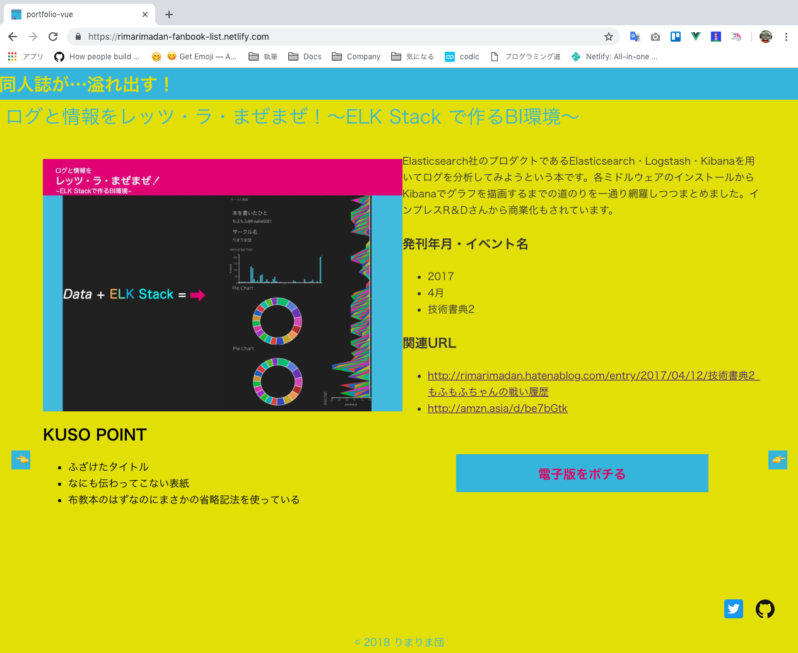

# まえがき

こんにちは。りまりま団のもふもふです。この本はノリで[クソアプリ Advent Calendar2018](https://qiita.com/advent-calendar/2018/kuso-app) （``https://qiita.com/advent-calendar/2018/kuso-app``）に申し込んでしまったもふもふちゃんがVue.jsでKUSO同人誌ポートフォリオをつくった記録をまとめたものです。

## 使った技術スタック

このWebアプリケーションを作成するために使ったモノを**全部**書きます。この本はお役に立てそうでしょうか？

### 周辺機器

Mac Book Pro 2015を使っていたのですが、Photoshopが動かなくなってしまったのでMac miniを購入しました。瞬きしている間にVueアプリケーションのビルドが終わります。メモリ32GBの力を感じます。

- Mac Book Pro（2015年購入）
- Mac mini（2018年11月購入）
- iPad Pro (9.7-inch)
- Apple Pencil

### アプリを作るのに使った技術

Vue CLI3を利用してセットアップしました。始めて触るのであればCDNを利用した方が良いでしょう。Vue CLIを利用する場合、所々公式ドキュメントの記述と違う書き方をする必要が出てくるので、「これどうすればいいんじゃ〜」となってしまって進まないからです。

- Vue.js
- Vue CLI3
- JavaScript/（ECMAScriptの記法を利用）
- CSS
- HTML5
- SVG

### 検査ツール

どちらもVisual Studio Code（以降VS Codeと記述します）記述のスタイルを検査するためだけに使用したため、本格的には導入できませんでした…。本格的な利用は次回に向けての宿題とします。

- ESLint
- Vue.js Extension Pack

### デバッグツール

普段ブラウザはChromeを利用しているので、デバッグもChromeで行いました。Vue.js公式から[デバッグツール]( https://chrome.google.com/webstore/detail/vuejs-devtools/nhdogjmejiglipccpnnnanhbledajbpd?hl=ja )が提供されているため、データがきちんと割り当てされているかはChromeで確認しました。

処理のデバッグ？それは``console``メソッドを使って行いました。VS Codeのデバッグツールは私には早すぎました。

devtoolsと一緒に使えなかった、という理由もあるのですが、セットアップ方法が間違ってたのかもしれません。この点も次回への宿題としたいと思います。

- Vue.js devtools

### アプリ用データ

文字列はJSONで、本の画像はPNGで管理することにしました。この理由は本編で記述します。

- JSON
- png

### バージョン管理

[portfolio-vue](https://github.com/MofuMofu2/portfolio-vue)という名前でGitHub上にリポジトリを作成しました。

- Git
- GitHub

### デプロイ先

費用はかけたくないし、できればGitHub連携したい。それに規模も小さい、ということでNetlifyを利用しました。

- Netlify

## 完成形

出来上がったものはこちらです。



URLにアクセスすると分かりますが、色づかいからもKUSO感が伝わってきます。
ただ、中身はVue.jsの基本機能を用いたWebアプリケーションとなっています。JSONからのデータの取得・Propsを利用した親子間でのデータ受け渡し・Propsで取得したデータを用いたDOM操作・SVGの利用などを行っています。

## というわけで本編です

GitHub上のissue順に何を考えて作ったかを書きました。Vue.jsの書き方・シンタックスはWebアプリケーションに利用したものに絞っています。ドキュメントや本・ブログを見ても「文法や機能はわかった。でも結局どーやって作り始めたらいいのかわからーん！」と思ってしまうので、私はこのように進めました。という知見はそれなりに有用なのではないか？と思うからです。

## 注意点など

本の内容は公式ドキュメントなどを元に動作確認を行ってはいますが、この本の情報を用いた開発・制作・運用に対して発生した全ての結果に対して責任は負うことはできません。必ずご自身の環境でよく検証してから導入をお願いします。
また、第5章以降は次のような表記が出てきます。マイナスは変更前/削除、プラスは変更後/追加を示しています。変更の差分が多く発生したため、git logと同じ表記を利用しています。
加えて、紙面の都合上コードの途中で改行している箇所があります。改行箇所に``\r``を記載している場合、ここで改行されたよという意味です。参考にする場合は改行・スペースを入れずに記載してください。

```text
- これは変更前のものか、削除された行です
+ これは変更後のものか、追加された行です
      <a href="https://twitter.com/froakie0021" target="blank">\r ←紙面の都合で改行しました
      </a>
```